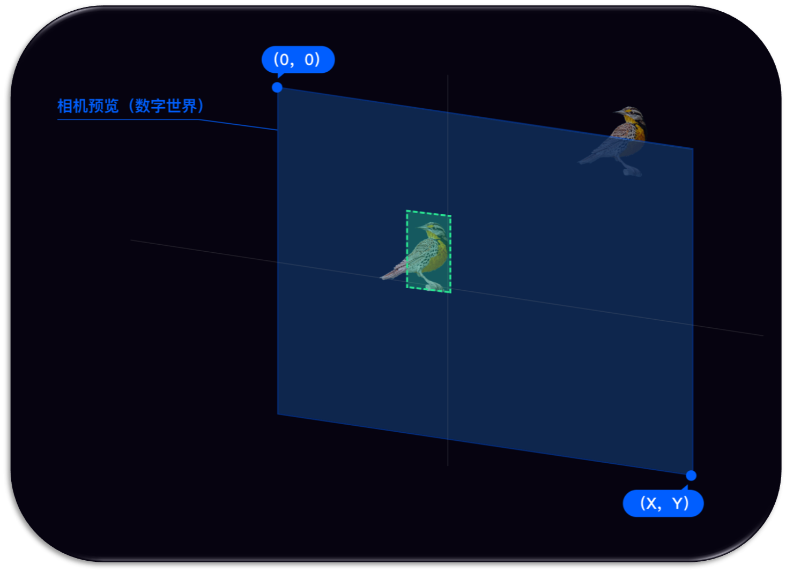
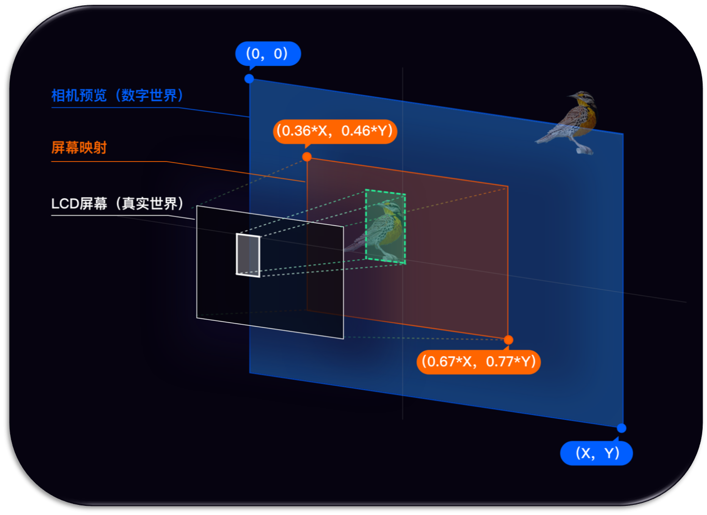
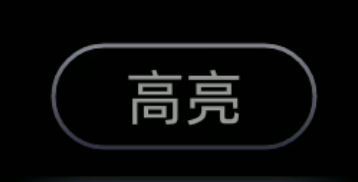
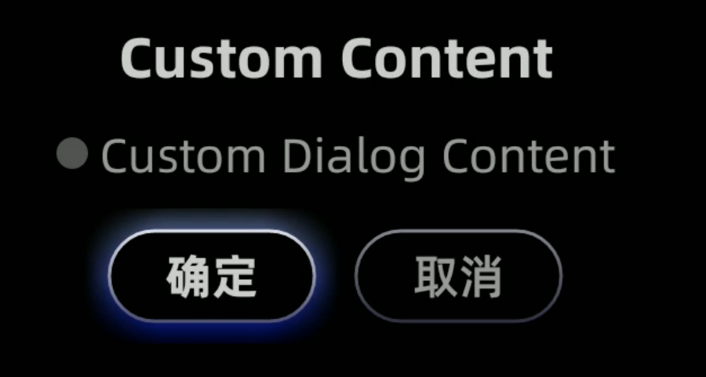
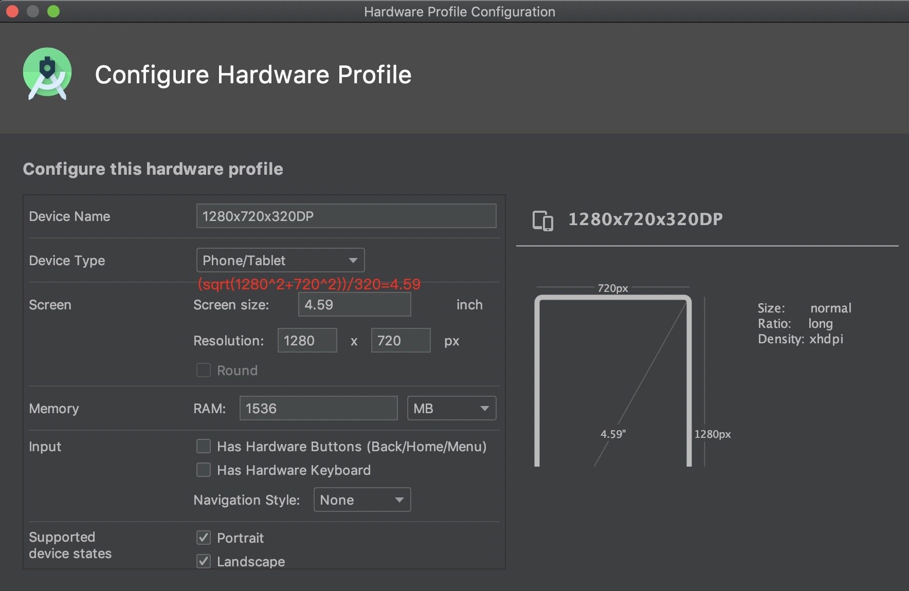

# Glass UI SDK (User Guide)
**Version: 1.5.4**

## 一、UI SDK介绍（UI SDK Introduction)
---
### 1.1 概述（Introduction)
提供一套在Rokid Glass上开发应用的基础UI库,目前已经提供以下支持：  
Rokid provides Basic UI SDK to help the developers to build apps in the Rokid Glass:

**1. GlassAlignment**   
由于AR 眼镜特有的屏幕显示特性，在开发眼镜上的识别类应用时，     
需要对marked UI做一次align，以保证人眼看到的marked UI和真实世界对齐。

**GlassAlignment** helps to make the alignemnt between the "markered UI" and the real physiclal when  developing the app with recognition features. 

**2. GlassButton**   
Glass自定义的Button
**GlassButton** helps to customize the events for the physical buttons.

**3. GlassDialog**   
提供了一系列常用的对话框
**GlassDialog** helps the developer to design and use the dialog in Glass.

## 二、集成说明(Integration)
---
在project的build.gradle中添加jcenter依赖
(Add jcenger into the build.gradle in the product):

``` gradle
allprojects {
    repositories {
        google()
        jcenter()
    }
}
```
### 2.1 Gradle依赖 (Gradle Dependency)
``` gradle
implementation 'com.rokid.glass:ui:1.5.4'
```

### 2.2 Demo
[Glass UI Demo](https://github.com/rokid/glass-ui)

## 三、功能列表 (Feature List)
---
### 3.1 RokidSystem
Alignment概念：
Camera预览界面通过Glass显示屏幕进入人眼睛的映射过程.

Alignment: Camera preview is mirrored into the display in the glasses. 


在手机上开发如下图(Developing app in the mobile device)


在眼镜上开发如下图(Developing app in the AR glasses)


1. 蓝色代表`相机预览`的画面  (Blue canvas is for "Camera Preview")
2. 绿色代表`相机预览`中物体的坐标   (Green part is for the bunding box of the target in the "Camera Preview")
3. 橙色代表`LCD屏幕`在`相机预览`的映射区域,百分比表示真实世界在虚拟世界的比例 (Orange canvas is for the area of the LCD display of AR glasses in the "Camera Preview")
4. 白色代表物体映射到`LCD屏幕`的显示区域 (White part is for the LCD display of AR glasses with the target)

#### 3.1.1 getAlignmentRect
说明：根据preview的rect，获取到映射到LCD屏幕的区域
Note: get the rectangle value of preivew in the LCD display 
```java
public static Rect getAlignmentRect(final int previewWidth, final int previewHeight, final Rect previewRect)
```  
|参数(Parameter)|含义(Meaning)|默认值（Default Value)
|---|---|---|
|previewWidth|Camera preview宽(Camera Preview Width)||
|previewHeight|Camera preview高(Camera Preview Height)||
|previewRect|Camera preview的Rect (Camera Preview Rectangle Area)||

示例代码：人脸识别后，在屏幕上画出人脸Rect   
Sample Code: After the face recognition, draw the Rect of face in the LCD display
``` java
public static final int PREVIEW_WIDTH = 1280;
public static final int PREVIEW_HEIGHT = 720;

//camera preview的人脸区域 (Face bundling rect area in the camera preview) 
Rect previewRect = faceDoCache.faceDo.toRect(getWidth(), getHeight());

//根据preview的人脸Rect，映射后，获取最终在屏幕上绘制的Rect (Face bundling rect area in LCD display)
Rect rect = RokidSystem.getAlignmentRect(PREVIEW_WIDTH, PREVIEW_HEIGHT,previewRect);

...
canvas.save();
canvas.translate((rect.left + rect.right) / 2f, (rect.top + rect.bottom) / 2f);

drawRect(canvas, 0, rect.width(), rect.height(), paint, rectConfig);
drawRect2(canvas, 0, rect.width(), rect.height(), paint, rectConfig);
drawRect(canvas, 180, rect.width(), rect.height(), paint, rectConfig);
drawRect2(canvas, 180, rect.width(), rect.height(), paint, rectConfig);

canvas.restore();
...
```
#### 3.1.2 getWindowRect
说明：根据LCD屏幕的rect，获取到preview的区域rect
Note: get the Rect area in preview based on the rect in LCD display.
``` java
public static Rect getWindowRect(final int previewWidth, final int previewHeight, final Rect windowRect)
```
|参数(Parameter)|含义(Meaning)|默认值(Default Value)
|---|---|---|
|previewWidth|Camera preview宽 (Width of camera preview)||
|previewHeight|Camera preview高 (Height of camera preview)||
|windowRect|屏幕上的Rect(Rect in LCD)||

示例代码: 根据屏幕上的roi区域，得到preview 上的roi区域
Sample Code: get the roi area in preview based on the roid in LCD display.
```java
Rect window = new Rect(0,0,1280,720);
roiRect = RokidSystem.getWindowRect2K(CameraParams.PREVIEW_WIDTH,CameraParams.PREVIEW_HEIGHT, window);
roiRect = FaceRectUtils.scaleRect(roiRect, CameraParams.PREVIEW_WIDTH,CameraParams.PREVIEW_HEIGHT, FaceParams.roiScale);
...

VideoDFaceConf config = new VideoDFaceConf();
config.setDataType(DataFormat.DATA_YUV420);
config.setSize(CameraParams.PREVIEW_WIDTH, CameraParams.PREVIEW_HEIGHT);
config.setRoi(roiRect);

```

#### 3.1.3 getProjectionMatrix_OpticalSeeThrough
说明：获取OpticalSeeThrough场景下，OpenGLES 3D 应用的投影矩阵（横屏状态），以便人眼看到的marked UI和真实世界对齐
Notes: As for the Optical-See-Through scenario get the projection matrix of OpenGLES 3D apps to ensure the alignment between the marked UI and the phyisical world. 

``` java
public static float[] getProjectionMatrix_OpticalSeeThrough()
```

示例代码: 对于横屏应用，获取OpenGLES MVP矩阵的投影矩阵
Sample Coce: As for the apps with the landscape orientation, get the projection matrix of OpenGLES MVP
```java
float projectionMatrix[] = RokidSystem.getProjectionMatrix_OpticalSeeThrough();
...

```

### 3.2 GlassButton
Glass自定义的Button (Pre-defined buttons in the glasses)

`Focused`:  


`Normal`



#### 3.2.1 用法(How to use)
``` xml
 <com.rokid.glass.ui.button.GlassButton
    android:id="@+id/custom_dialog_btn"
    android:layout_width="wrap_content"
    android:layout_height="wrap_content"
    android:text="Custom Dialog"
    app:layout_constraintLeft_toLeftOf="parent"
    app:layout_constraintRight_toRightOf="parent"
    app:layout_constraintTop_toBottomOf="@id/dialog_btn" />
```
### 3.3 GlassDialog
提供了一系列常用的对话框,通过不同Builder 来构建不同类型的对话框（Rokid provides the useful dialog framework to help build the various dialog box with Builders):
We provide the following Builders:

#### 3.3.1 CommonDialogBuilder
通用的 DialogBuilder(Universal DialogBuilder)



|方法(Function)|含义(Meaning)|备注(Notes)
|---|---|---|
|setTitle|设置标题(Set Title)||
|setContent|设置内容(Set Content）|和自定义内容布局选其一（Use setContent or customized content)|
|setConfirmText|设置确定按钮文字（Set text for confirm button)||
|setCancelText|设置取消按钮文字（Set text for cancel button)||
|setContentLayoutId|设置内容自定义布局id（Set customized content layout ID)||
|setContentLayoutView|设置内容自定义布局View（Set customized content layout View)|和setContentLayoutId选其一(Use ‘setContentLayoutView’ or setContentLayoutId)|
|setConfirmListener|设置Confirm监听(set the listener for Confirm||
|setCancelListener|设置Cancel监听(set the listener for Cancel||

**示例代码(Sample Code)**
``` java
new GlassDialog.CommonDialogBuilder(this)
        .setTitle("Title")
        .setContent("Content")
        .setConfirmText("Confirm")
        .setCancelText("Cancel")
        .setContentLayoutId(R.layout.layout_custom_dialog_content)
        .setConfirmListener(new GlassDialogListener() {
            @Override
            public void onClick(View view) {

            }
        })
        .setCancelListener(new GlassDialogListener() {
            @Override
            public void onClick(View view) {

            }
        })
        .show();
```
### 3.4 屏幕适配(Display Setting)
接入，在app的`AndroidManifest.xml`声明(Add the following statement in the app's `AndroidManifest.xml`):
``` java
<manifest>
    <application>            
        <meta-data
            android:name="design_width_in_dp"
            android:value="640"/>
        <meta-data
            android:name="design_height_in_dp"
            android:value="360"/>           
     </application>           
</manifest>
```
这里的都是根据设计图的尺寸来，以宽或者高为基准，默认是宽。
The dimension is based the value of width or height. The width value is set as default.
#### 模拟器Preview设置(Preview Setting for the emulator in Android Studio) 

